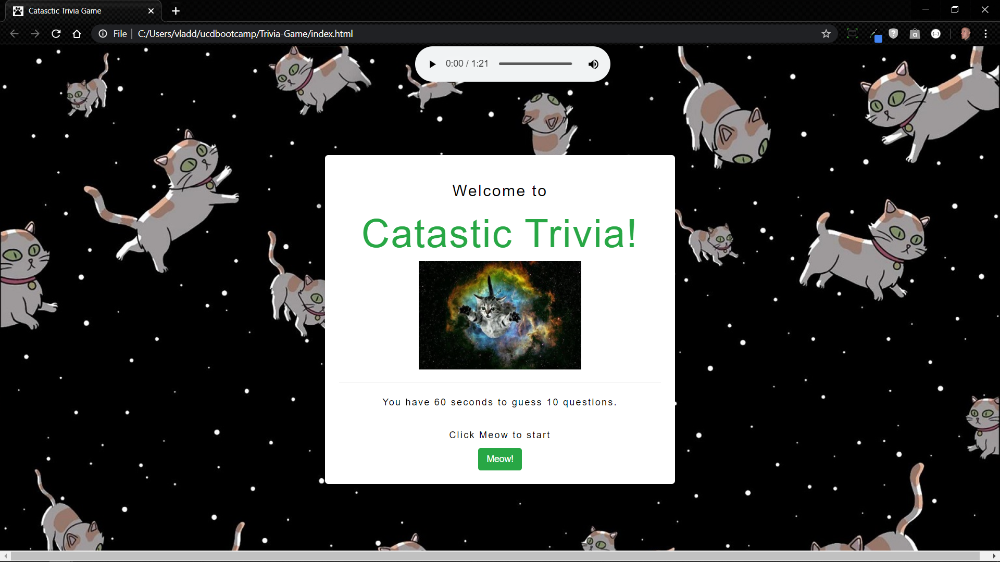
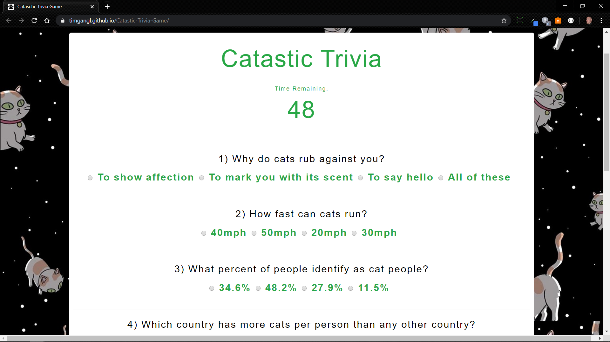

# Catastic-Trivia-Game
This is a fun Trivia game on the topic of cats. The user has sixty seconds to answer 10 multiple choice questions. There is also a fun little song the user can listen to while taking the quiz courtesy of Steven Ibsen (original song from Kitty Cat Dance). 

## Getting Started
To run the application locally, first clone this repository with the following command:

```
git clone git@github.com:TimGangl/Catastic-Trivia-Game.git
```
Once this is done then all you need to do is click on the index.html file in the repositories root folder and you are ready to play.

## Built With
* HTML
* CSS
* Bootstrap 
* Javascript

## Screenshot
Screenshot of the Start page
<br>

<br>
Screenshot of questions
<br>


